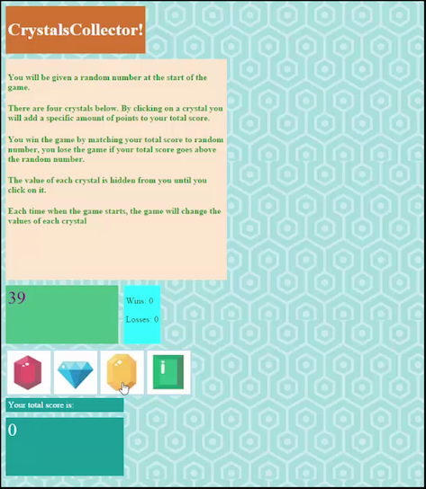

*Crystal-Game*
==============

Week 3 Monday UCF Full Stack Developer Bootcamp

JQuery used to complete this game

build on HTML, CSS & Javascript training by adding jQuery into toolset to build
this interactive game.

will utilize tools and knowledge of all four languages to provide the user a
interesting experience.

\*\* \*\* \*\* \* \*\*\*

**Crystal Game logic flow /code plan:**

Crystal game

Random range finder function ---call at beginning of game & again at end of each
game

Pick random number 1- 500

Random number generator function

Utilize range-finder as upper limit & create new\# on call

Winning score generator

Range of \<4x range-finder

Crystal-score-value function:

random number generator (range of range-finder)

attach value to each of four crystals (replace current value);

Draw four buttons

attach: name, image, score-value, mayben hover or click activity like blink?

Call winning-score

\$('.card-body').on("click", ".clear", clear);

\$('.card-body').on("click", ".clear", clear);

\$(‘class-name’).on(“click”, “.button name”, function-name);

Click \$('.card-body').on("click", ".number", function() { num1 += this.value;
console.log(Num1);}

Aka= \$(‘.button-class’).on(“click”. “.number”, function() { globalvar +=
this.value; console.log

\$('.card-body').on("click", ".operator", function() { \< - - - function to
convert symbol word to symbol

flag = true;

operator = this.value; variable word

console.log(operator); variable name

update(); (function name)

});

\*\* \* \*\* \*\*

Game on:

wins= 0

losses = 0

gamescore =0

Calculate range & set variable

Calculate winning score & set variable

Calculate crystal values & assign to each

Listen for clicks

Increase game score by crystal value

Compare game score to winning score

Gs\<ws… output click again

Gs = ws … output …congratulations

Gs .ws … output you lose, play again?, play sound

If yes, go back to game score

If no, change screen /play sound /end program

\*\* \*\* \* \*\*other notes \*\* \* \*\* \* \*

Increment winning score by value

Total +=

Test for \<, = , \> winning score

If \<, play again, increment counter

If=, win! Increment

If \>, loss, increment

Instead of;

Alert(“user text”); Javascript for output, or

Console.log(“user text”, var);

\$(‘\#user text’).text(variable name); \< - - - -doesn’t work? (as expected, at
least)

\$("user text").text(counter);

**ORIGINAL HOMEWORK INSTRUCTIONS**

jQuery Assignment
=================

### Overview

In this assignment, you'll create another fun and interactive game for web
browsers. This time, your app must dynamically update your HTML pages with the
jQuery library.

### Before You Begin

1.  Create a new GitHub repo called `unit-4-game`, then clone it to your
    computer.

2.  Inside the `unit-4-game` folder, create an `index.html` file.

3.  Still inside the `unit-4-game` directory, make a folder called `assets`.

-   Inside the `assets` directory, make three additional folders: `javascript`,
    `css` and `images`.

    -   In the `javascript` folder, make a file called `game.js`.

    -   In the `css` folder, make a file called `style.css`.

    -   In the `css` folder, make a file called `reset.css`. Paste into it the
        code found from the Meyerweb Reset.

    -   In the images folder, save any of the images you plan on using.

1.  Set up your repository to deploy to Github Pages.

2.  Push the above changes to GitHub.

3.  Choose whichever game you want to make from the choices below. The
    CrystalsCollector game is the recommended option, but if you are looking for
    an extra hard challenge then take a stab at the Star Wars exercise. (Note:
    Only choose the Star Wars Exercise if you are feeling very comfortable with
    the material covered in class. The Crystal Collector activity is plenty
    challenging enough!).

### Option One: CrystalsCollector Game (Recommended)

Crystal Collector

1.  [Watch the demo](homework_demos/crystalsCollector_demo.mp4).

2.  The player will have to guess the answer, just like in Word Guess. This
    time, though, the player will guess with numbers instead of letters.

3.  Here's how the app works:

-   There will be four crystals displayed as buttons on the page.

-   The player will be shown a random number at the start of the game.

-   When the player clicks on a crystal, it will add a specific amount of points
    to the player's total score.

    -   Your game will hide this amount until the player clicks a crystal.

    -   When they do click one, update the player's score counter.

-   The player wins if their total score matches the random number from the
    beginning of the game.

-   The player loses if their score goes above the random number.

-   The game restarts whenever the player wins or loses.

    -   When the game begins again, the player should see a new random number.
        Also, all the crystals will have four new hidden values. Of course, the
        user's score (and score counter) will reset to zero.

-   The app should show the number of games the player wins and loses. To that
    end, do not refresh the page as a means to restart the game.

##### Option 1 Game design notes

-   The random number shown at the start of the game should be between 19 - 120.

-   Each crystal should have a random hidden value between 1 - 12.
